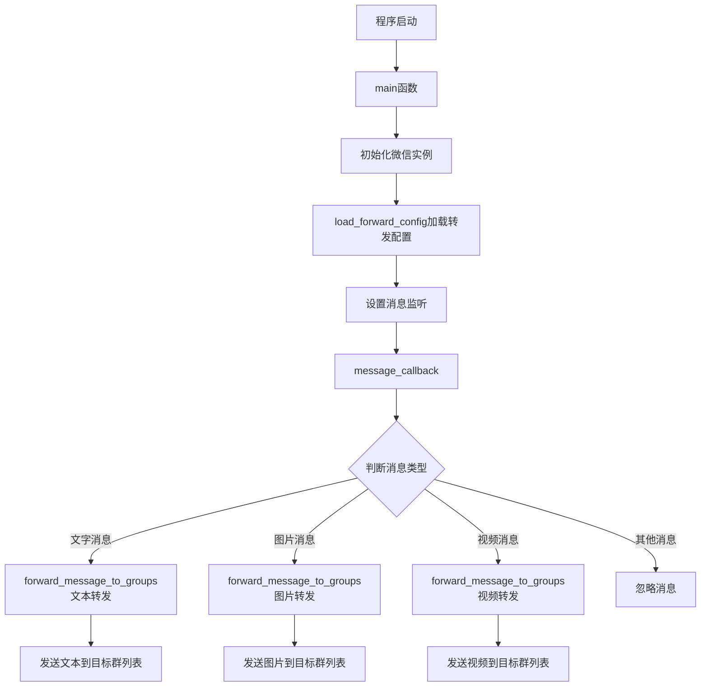

# 微信群消息转发器

一个基于 wxautox 库的微信群消息自动转发工具，支持文字、图片、视频消息的智能转发。

## 功能特性

- 🔄 **多类型消息转发**：支持文字、图片、视频消息的自动转发
- 📝 **配置文件管理**：通过简单的配置文件设置源群和目标群
- 🎯 **精准监听**：监听指定源群的消息并转发到多个目标群
- 📊 **详细日志**：完整的操作日志记录，支持彩色控制台输出
- ⏱️ **超时控制**：视频下载支持2分钟超时控制，避免大文件阻塞
- 🛡️ **错误处理**：完善的异常处理和错误恢复机制
- 🧹 **自动清理**：转发完成后自动清理临时文件

## 系统要求

- Python 3.7+
- Windows 操作系统
- 微信 PC 版客户端
- wxauto 库

## 安装依赖

```bash
pip install -r requirements.txt
```

## 配置说明

1. 首次运行程序会自动创建 `forward_config.txt` 配置文件
2. 编辑配置文件，设置源群和目标群：

```text
# 群消息转发配置文件
# 第一行：源群名称（要监听的群）
# 后续行：目标群名称列表（要转发到的群，每行一个）
# 以#开头的行为注释行

# 源群（监听此群的消息）
工作群

# 目标群列表（转发到这些群）
通知群1
通知群2
备份群
```

## 使用方法

1. **启动微信客户端并登录**
2. **运行转发程序**：
   ```bash
   python group_message_forwarder.py
   ```
3. **程序会自动**：
   - 初始化微信实例
   - 加载转发配置
   - 开始监听源群消息
   - 自动转发到目标群列表

## 程序架构



## 核心功能模块

### 日志系统
- `log_info()`: 记录正常信息日志，绿色控制台输出
- `log_error()`: 记录错误日志，红色控制台输出

### 配置管理
- `load_forward_config()`: 从配置文件读取转发设置

### 消息处理
- `message_callback()`: 处理接收到的消息
- `forward_message_to_groups()`: 执行消息转发

### 主程序
- `main()`: 程序入口，初始化和监听控制

## 日志文件

- `group_forwarder.log`: 正常操作日志
- `group_forwarder_error.log`: 错误日志

## 注意事项

1. **微信客户端要求**：
   - 确保微信PC版已登录
   - 微信客户端需要保持运行状态
   - 群名称必须与配置文件中完全一致

2. **权限要求**：
   - 确保在源群中有接收消息的权限
   - 确保在目标群中有发送消息的权限

3. **性能优化**：
   - 程序会在转发消息间添加0.5秒延迟，避免发送过快
   - 大视频文件下载设置2分钟超时限制
   - 临时文件会在转发完成后自动清理

4. **安全提醒**：
   - 请谨慎设置转发规则，避免消息泄露
   - 建议在测试环境中先验证功能

## 故障排除

### 常见问题

1. **微信实例初始化失败**
   - 检查微信客户端是否正常运行
   - 确认微信已登录
   - 重启微信客户端后重试

2. **找不到群聊**
   - 检查群名称是否与配置文件完全一致
   - 确认群聊在微信中可见
   - 检查是否有群聊权限

3. **消息转发失败**
   - 检查目标群是否存在
   - 确认在目标群中有发送权限
   - 查看错误日志获取详细信息

## 许可证

本项目采用 MIT 许可证，详见 LICENSE 文件。

## 贡献

欢迎提交 Issue 和 Pull Request 来改进这个项目。

## 作者

李祥光 (lixiangguang)
- Email: 274030396@qq.com
- GitHub: [@lixiangguang](https://github.com/lixiangguang)
